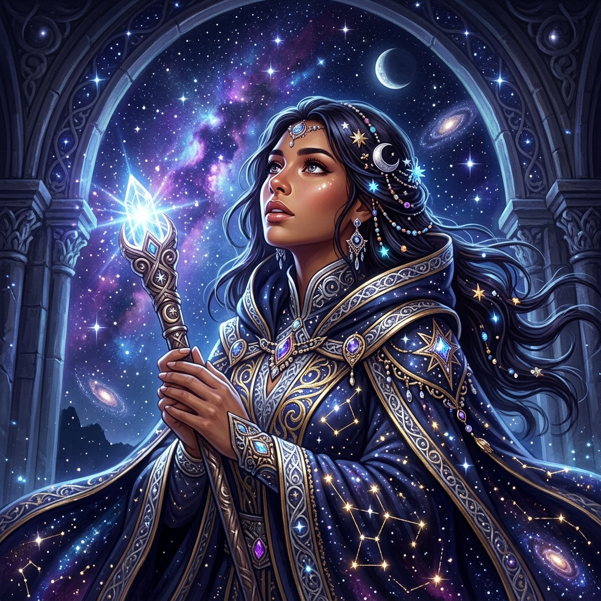

<div align="center">
  
  
  <h1>🌑 Echoes of the Arcane (FBTI) 🌑</h1>
  <p><strong>A Dark Fantasy MBTI Personality Test & Gacha Game</strong></p>

  []([https://ampsoria.github.io/FBTI/](https://ampsoria.github.io/fantasy-mbti-gacha/))
  [](#)
</div>

---

## 📜 The Prophecy (Overview)
**Echoes of the Arcane** is a highly interactive, atmospheric web application that reimagines the standard MBTI personality test. Abandon the mundane world; instead, you must embark on a dark fantasy quest, navigating 12 perilous and morally ambiguous scenarios. 

Your choices shape your cognitive axes (E/I, S/N, T/F, J/P) and ultimately dictate your destiny, unlocking one of **24 unique fantasy archetypes** through a thrilling Gacha summoning ritual! 

### ✨ The Grimoire (Features)
- 🌌 **Immersive Quiz Engine:** 12 immersive fantasy scenarios to reveal your true nature.
- 🔮 **Gacha Summoning:** A mesmerizing card reveal animation with void particles and dynamic rarity tiers (Common 🛡️, Rare ⚔️, Super Rare 🌟, Secret 👁️).
- 🦇 **24 Unique Archetypes:** Bespoke character portraits and deep, mysterious lore for each of the 16 MBTI types (plus hidden paradoxes).
- 🩸 **Save Your Soul (Share):** Built-in `html2canvas` logic to instantly capture and download your beautiful result card as an image.
- 📜 **Dual Language Support:** Fully localized in both English and Thai.

## 🛠️ The Arcane Tools (Tech Stack)
- **Frontend:** Vanilla TypeScript, HTML5, Modern CSS (Dark Glassmorphism, CSS Animations)
- **Tooling:** [Vite](https://vitejs.dev/) for blazing fast spells (builds)
- **Runes & Graphics:** [Lucide Icons](https://lucide.dev/), `html2canvas`

## ⚔️ The Ritual (Local Development)

```bash
# 1. Unseal the repository
git clone https://github.com/ampsoria/FBTI.git

# 2. Enter the void
cd FBTI

# 3. Gather the artifacts (install dependencies)
npm install

# 4. Ignite the magic circle (start development server)
npm run dev
```

## 🦇 Ascending to the Stars (Deployment)
This grimoire is configured to be deployed easily to **GitHub Pages**.
1. Cast `npm run build` to generate the `dist/` realm.
2. The `vite.config.ts` is already imbued with `base: './'` to navigate subfolder domains perfectly.
3. Push the `dist` contents to your `gh-pages` branch, or allow GitHub Actions to build and deploy for you.

---
*Created with dark magic and ancient code.* 🩸✨
